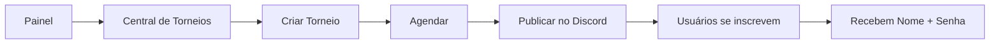
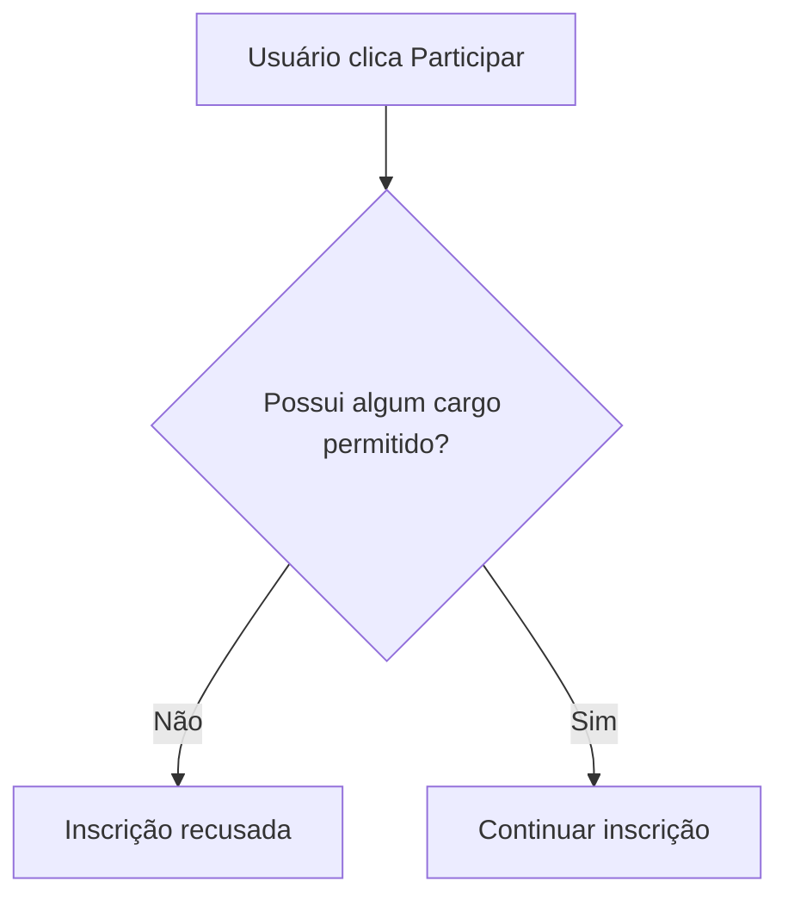
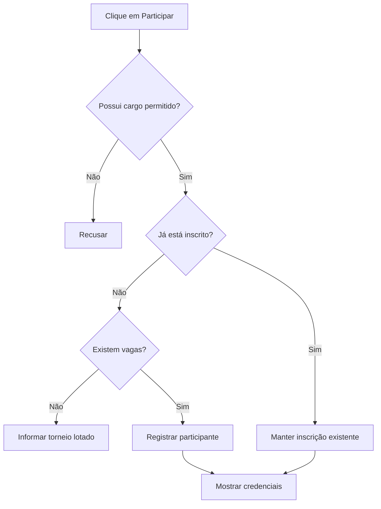
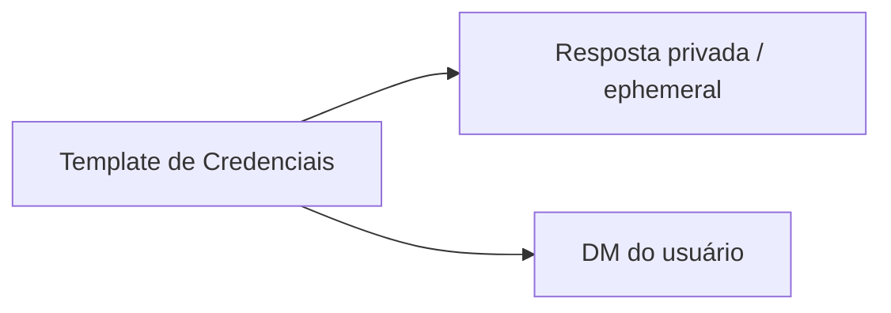
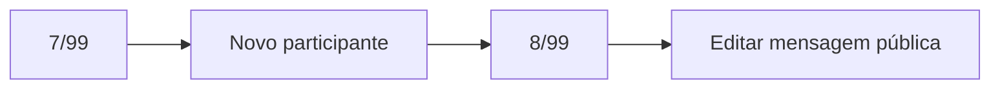
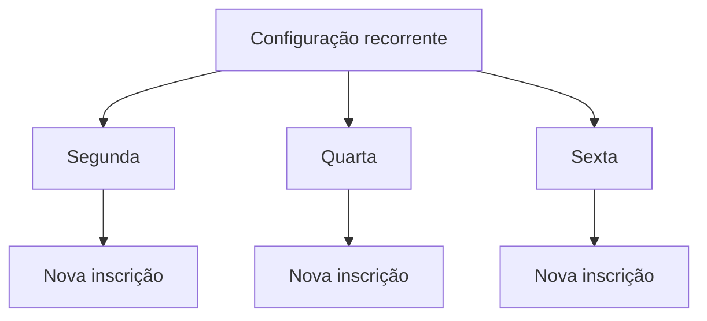
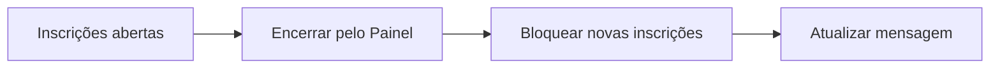
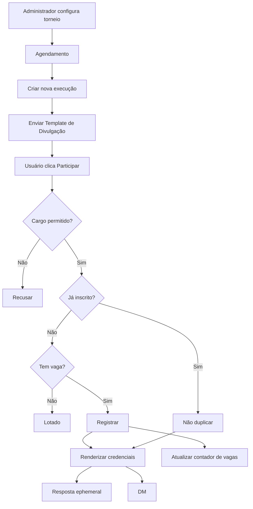

# Central de Torneios — Proposta Funcional

> Documento de apresentação da nova funcionalidade exclusiva **Central de Torneios**.

---

## Objetivo

Criar uma nova área no Painel chamada **Central de Torneios**, independente da aba de Rocket League.

A funcionalidade permitirá criar e agendar inscrições para torneios, controlar vagas, limitar participantes por cargos e distribuir automaticamente o nome e a senha do torneio para quem se inscrever.



---

# 1. Disponibilidade

A Central de Torneios será uma funcionalidade liberada apenas para bots autorizados.

```text
Bot A
Central de Torneios: habilitada

Bot B
Central de Torneios: desabilitada
```

Quando não estiver habilitada, a área não aparecerá no Painel.

---

# 2. Criação de vários torneios

Será possível manter várias configurações ao mesmo tempo.

```text
Central de Torneios
├─ Bronze - Ouro
├─ Platina - Diamante
├─ Champion - SSL
└─ Torneio Especial
```

Cada torneio terá seus próprios canal, cargos permitidos, vagas, programação, nome da sala, senha, templates e participantes.

---

# 3. Configuração principal

Cada torneio possuirá:

```text
Nome da configuração
Canal de envio
Cargos permitidos
Número máximo de vagas

Nome do torneio/sala
Senha

Programação

Template de Divulgação
Template de Credenciais
```

A descrição e a imagem não terão campos separados. Todo o visual será criado através do **Template Builder V2**.

---

# 4. Template de Divulgação

Será a mensagem pública enviada no Discord.

Poderá conter imagens, textos, regras, horário, cargos permitidos, quantidade de vagas, botão de participar e demais componentes suportados pelo Builder.

```text
┌────────────────────────────────────┐
│         TORNEIO BRONZE - OURO      │
│                                    │
│          [ imagem / banner ]       │
│                                    │
│ Inscrições abertas!                │
│                                    │
│ Cargo necessário: Bronze - Ouro    │
│ Vagas: 7/99                        │
│                                    │
│ [ Participar ] [ Vagas: 7/99 ]     │
└────────────────────────────────────┘
```

---

# 5. Botões da mensagem

Inicialmente a mensagem pública terá:

```text
[ Participar ] [ Vagas: atual/máximo ]
```

O botão de **Participar** registra a inscrição.

O indicador de **Vagas** será atualizado conforme novos usuários entram.

O encerramento manual será feito pelo Painel Web. Não haverá botão público de "Fechar" nesta primeira versão.

---

# 6. Cargos permitidos

Será possível selecionar vários cargos.

A regra será:

```text
Cargo A OU Cargo B OU Cargo C
```

Quem possuir pelo menos um dos cargos poderá entrar.



Possuir mais de um cargo permitido não gera vantagem nem entradas adicionais.

---

# 7. Inscrição

Ao clicar em **Participar**:



O mesmo usuário nunca será registrado duas vezes.

---

# 8. Template de Credenciais

Haverá um segundo Template Builder específico para a mensagem privada de acesso ao torneio.

```text
✅ Inscrição confirmada!

Nome:
{{tournamentName}}

Senha:
{{tournamentPassword}}

Boa sorte!
```

Esse template será enviado de duas formas:



---

# 9. DM fechada

Se o usuário estiver com DMs fechadas:

```text
Inscrição continua válida
+
resposta ephemeral continua funcionando
+
falha da DM não cancela a entrada
```

---

# 10. Usuário clica novamente

Caso o usuário já esteja inscrito e clique novamente:

```text
não cria nova inscrição
↓
informa que ele já está inscrito
↓
mostra novamente Nome + Senha
↓
tenta enviar novamente por DM
```

Isso permite recuperar facilmente as credenciais.

---

# 11. Nome e senha

O sistema terá dois campos:

```text
Nome do torneio/sala
Senha
```

A senha terá:

```text
[ Gerar senha aleatória ]
```

O administrador também poderá digitar a senha manualmente.

Nome e senha poderão ser alterados mesmo depois de o torneio estar agendado. Os templates sempre utilizarão os valores atuais.

---

# 12. Variáveis de template

Inicialmente serão disponibilizadas variáveis como:

```text
{{tournamentName}}
{{tournamentPassword}}

{{participant}}
{{participant.id}}
{{participant.username}}
{{participant.displayName}}

{{currentParticipants}}
{{maxParticipants}}
{{remainingSlots}}

{{startsAt}}
```

Exemplo no Template de Divulgação:

```text
Vagas:
{{currentParticipants}}/{{maxParticipants}}
```

Exemplo no Template de Credenciais:

```text
Nome: {{tournamentName}}
Senha: {{tournamentPassword}}
```

---

# 13. Atualização das vagas

Quando alguém entrar:



Ao atingir o limite, novas inscrições serão bloqueadas. O botão de participação poderá ser desabilitado automaticamente quando o torneio lotar ou for encerrado.

---

# 14. Agendamento

O sistema utilizará a mesma ideia do novo sistema de agendamento planejado para Sorteios V2.

Será possível escolher:

```text
Data específica
ou
Recorrência
```

## Data específica

```text
25/08/2026
19:00
America/Sao_Paulo
```

## Recorrência

```text
Toda:
Segunda
Quarta
Sexta

às 19:00
America/Sao_Paulo
```

Cada ocorrência será uma nova execução.



Cada execução terá nova mensagem, participantes zerados, vagas zeradas e ID próprio.

---

# 15. Encerramento pelo Painel

Nesta primeira versão, o administrador poderá encerrar inscrições diretamente no Painel.



---

# 16. Fluxo completo



---

# 17. Nome da funcionalidade

Nome recomendado:

# **Central de Torneios**

Nome técnico interno sugerido:

```text
Tournament Hub
```

A ideia é não vincular o recurso exclusivamente a Rocket League, permitindo evolução futura para outros tipos de eventos.

---

# 18. Resultado esperado

A Central de Torneios permitirá administrar torneios de forma organizada:

```text
Painel
→ agenda
→ publica
→ controla cargos
→ controla vagas
→ registra participantes
→ distribui credenciais
→ atualiza mensagem
→ permite encerrar inscrições
```

Tudo utilizando o mesmo sistema visual de Templates V2 já utilizado no restante do projeto.
