# Sistema de Sorteios — Evolução Planejada

> Documento funcional para validação com o cliente.  
> Esta evolução do sistema de sorteios será disponibilizada para todos os bots.

---

## 1. Objetivo

Evoluir o sistema atual de sorteios para permitir:

- sorteios por botão ou por cargos;
- programação única ou recorrente;
- duração configurável por execução;
- templates V2 totalmente personalizáveis;
- uso avançado dos dados dos vencedores;
- ranking dinâmico até o último participante;
- criação de uma nova execução a cada recorrência;
- compatibilidade com sorteios existentes.

---

# 2. Visão geral

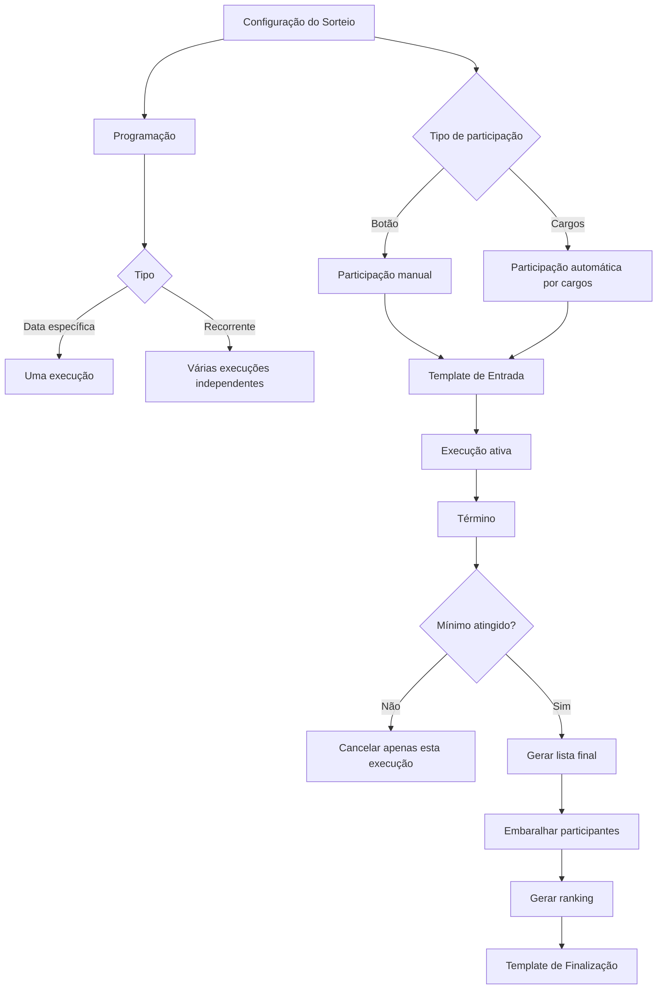

---

# 3. Campos principais

A nova tela deverá possuir aproximadamente:

```text
Nome do Sorteio
Canal de Envio

Tipo de Participação
├─ Botão
└─ Cargos

Mínimo de Participantes
Máximo de Participantes

Programação
├─ Data específica
└─ Recorrência

Término
├─ Duração
└─ Data/Hora específica

Formato de Finalização
├─ Substituir mensagem original
└─ Enviar nova mensagem

Template de Entrada
Template de Finalização
```

No modo por cargos também haverá:

```text
Cargos participantes
├─ Cargo A
├─ Cargo B
└─ Cargo C
```

---

# 4. Tipos de participação

## 4.1. Participação por botão

O funcionamento será semelhante ao sistema atual.

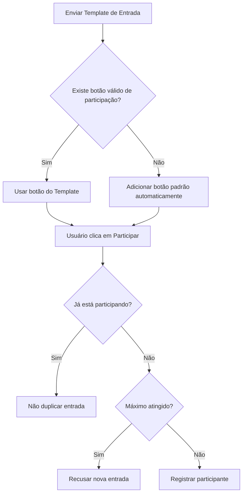

O campo separado de:

```text
Botão Customizado
```

deixa de ser necessário.

O botão passa a fazer parte do próprio **Template de Entrada**.

O Message Builder poderá ter uma ação específica:

```text
Participar do Sorteio
```

O Custom ID real será resolvido no momento da execução.

Exemplo conceitual:

```text
cmd:giveaway:join:{{giveawayId}}
```

Assim um template recorrente pode ser reutilizado, mas cada execução terá seu próprio ID.

---

## 4.2. Participação por cargos

Neste tipo não haverá botão de participação.

Os participantes serão resolvidos no momento da finalização.

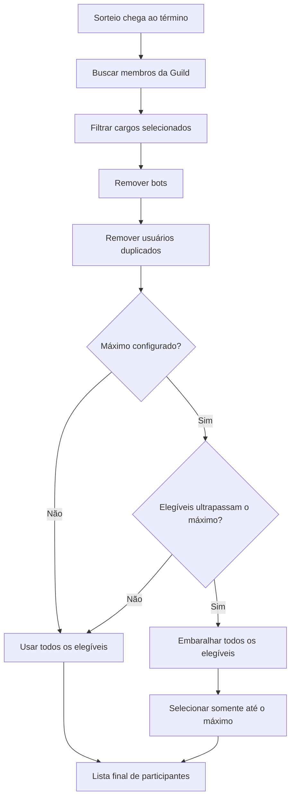

### Regras confirmadas

- possuir **qualquer um** dos cargos selecionados já qualifica;
- possuir vários cargos elegíveis continua valendo apenas **uma entrada**;
- bots não participam;
- somente usuários que possuírem os cargos no momento da finalização participam;
- não existe botão de participação nesse modo.

---

# 5. Mínimo de participantes

Se o mínimo configurado não for atingido, aquela execução será cancelada.

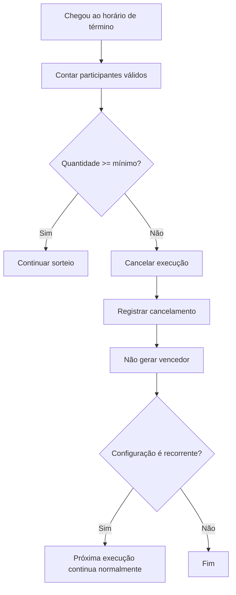

Exemplo:

```text
Mínimo: 10

Segunda:
6 participantes
→ execução cancelada

Quarta:
nova execução
→ funciona normalmente
```

O cancelamento afeta apenas aquela execução.

---

# 6. Máximo de participantes

## 6.1. Sorteio por botão

O máximo funciona como limite de entrada.

```text
Máximo = 100

Participantes = 100
→ novas entradas são recusadas
```

---

## 6.2. Sorteio por cargos

O máximo será aplicado de forma aleatória.

Exemplo:

```text
800 usuários elegíveis
Máximo = 100
```

Fluxo:

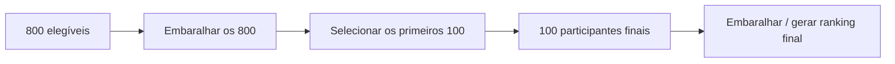

Assim os 800 possuem chance de participar, mas apenas 100 entram naquela execução.

---

# 7. Programação

O sistema antigo de:

```text
Data e Hora de Envio
Data e Hora de Término
```

será substituído por uma configuração semelhante ao Agendador já existente no Painel.

---

## 7.1. Data específica

Exemplo:

```text
Tipo: Data específica
Data: 30/08/2026
Horário: 20:00
Fuso: America/Sao_Paulo
```

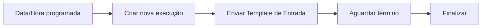

---

## 7.2. Recorrência

Será possível selecionar um ou vários dias da semana.

Exemplo:

```text
Segunda
Quarta
Sexta

20:00
America/Sao_Paulo
```

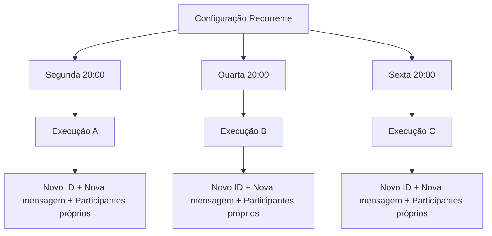

Cada recorrência cria um **novo sorteio**.

Não será reutilizado:

- o ID da execução anterior;
- a mensagem anterior;
- os participantes anteriores;
- o resultado anterior.

---

# 8. Término da execução

O usuário poderá escolher entre:

```text
Duração
ou
Data/Hora específica
```

---

## 8.1. Duração

Exemplos:

```text
30 minutos
2 horas
24 horas
3 dias
```

Exemplo:

```text
Envio:
Segunda 12:00

Duração:
24 horas

Término:
Terça 12:00
```

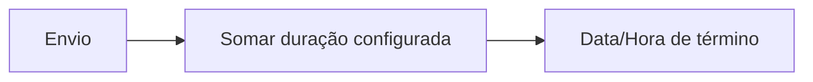

---

## 8.2. Data e hora específica

Exemplo:

```text
Enviar:
30/08/2026 12:00

Finalizar:
31/08/2026 18:00
```

Este formato poderá ser usado principalmente para execuções únicas.

---

# 9. Regra da próxima execução

Uma execução recorrente não poderá ultrapassar a próxima data de envio.

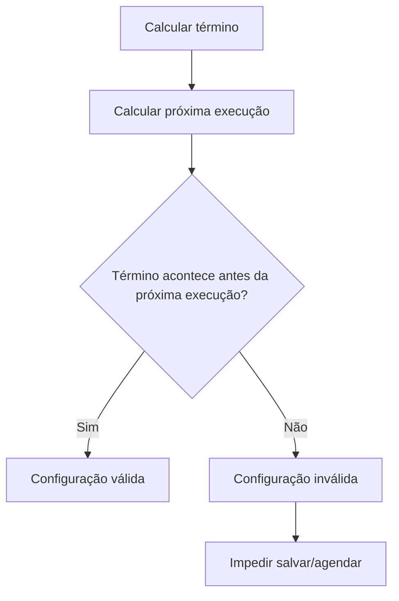

Exemplo válido:

```text
Agenda:
Segunda e Quarta às 20:00

Segunda:
20:00 → inicia

Terça:
20:00 → termina

Quarta:
20:00 → próxima execução
```

Exemplo inválido:

```text
Agenda:
Segunda e Quarta às 20:00

Segunda:
20:00 → inicia

Quinta:
20:00 → término configurado

Porém:
Quarta 20:00 já existe uma nova execução.
```

Nesse caso a interface deverá impedir a configuração.

---

# 10. Templates V2

O sistema continuará usando o **Message Builder V2**.

## Template de Entrada

Pode conter:

```text
Container
├─ Media Gallery
├─ Text Display
├─ Separator
├─ Section
├─ Buttons
└─ demais componentes suportados
```

No modo por botão, o template poderá conter o botão de participação em qualquer posição suportada pelo Builder.

No modo por cargos, o botão de participação não será necessário.

---

# 11. Botão de participação no Builder

Novo comportamento:

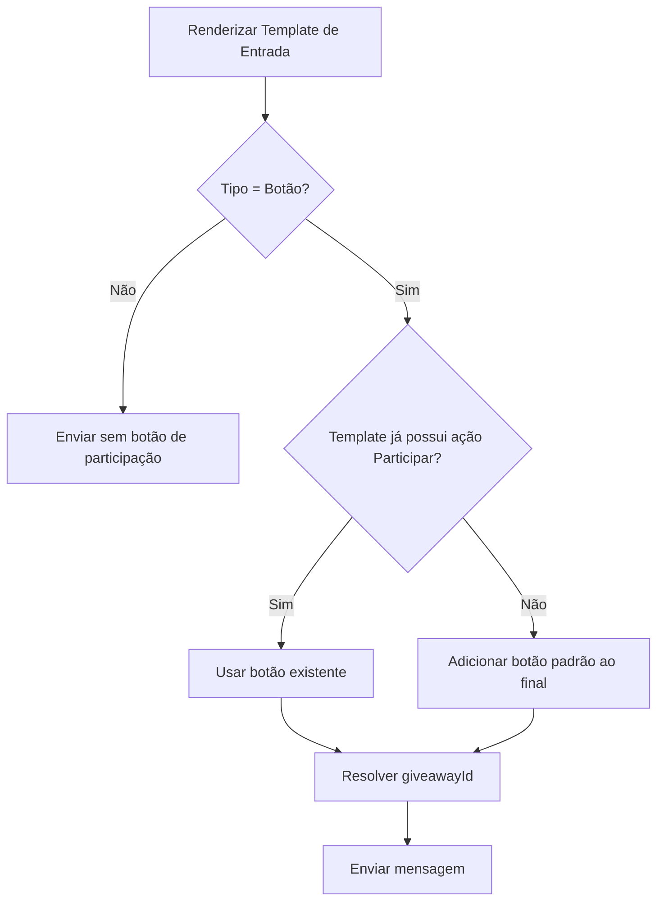

O administrador poderá:

- personalizar emoji;
- personalizar texto;
- escolher estilo;
- mover o botão dentro do Builder;
- excluir o botão automático após criar seu próprio botão.

---

# 12. Migração dos sorteios existentes

Os sorteios antigos devem continuar funcionando.

Configuração atual:

```text
buttonConfig
├─ emoji
├─ label
└─ style
```

Durante a migração:

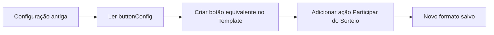

Nenhum sorteio existente deverá perder:

- texto do botão;
- emoji;
- estilo;
- template;
- participantes;
- programação válida.

---

# 13. Variáveis dos vencedores

As variáveis existentes continuarão funcionando:

```text
{{winner}}
{{pos1}}
{{pos2}}
{{pos3}}
...
{{posLast}}
```

Por compatibilidade:

```text
{{winner}}
```

continua gerando uma menção Discord:

```text
<@USER_ID>
```

---

# 14. Ranking sem limite fixo

O limite atual de `pos1` até `pos100` será removido.

As posições serão resolvidas dinamicamente até o tamanho total da lista.

Exemplo:

```text
100 participantes
→ {{pos1}} ... {{pos100}}

800 participantes
→ {{pos1}} ... {{pos800}}

2.500 participantes
→ {{pos1}} ... {{pos2500}}
```

`{{posLast}}` continuará representando a última posição.

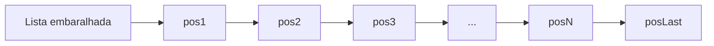

---

# 15. Dados avançados dos vencedores

Além da menção simples, será possível utilizar propriedades do usuário.

Exemplos:

```text
{{winner.id}}
{{winner.username}}
{{winner.globalName}}
{{winner.displayName}}

{{pos1.id}}
{{pos1.username}}
{{pos1.globalName}}
{{pos1.displayName}}

{{pos1.avatarURL}}
{{pos1.displayAvatarURL}}
{{pos1.bannerURL}}
```

Também deverá existir suporte controlado a opções de imagem.

Exemplo:

```text
{{pos1.displayAvatarURL({ size: 2048 })}}
```

---

# 16. Segurança das funções de template

O sistema não deverá expor livremente o objeto Discord.js inteiro.

Será criada uma camada segura de dados/funções permitidas.

Exemplo:

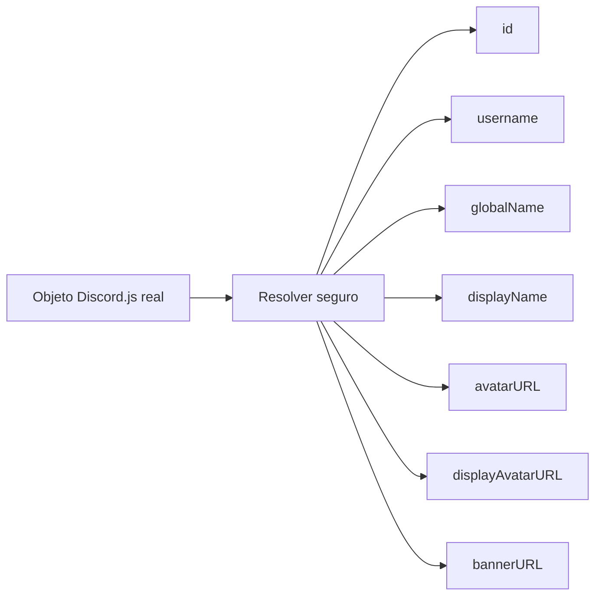

Não será permitido executar métodos arbitrários do Discord.js a partir do template.

---

# 17. Fallback de imagens e valores

Como o sistema utiliza LiquidJS, poderá ser utilizado o filtro `default`.

Exemplo:

```text
{{ pos1.bannerURL | default: "https://site.com/banner-padrao.png" }}
```

ou:

```text
{{ pos1.displayAvatarURL({ size: 2048 }) | default: "https://site.com/avatar.png" }}
```

Isso permite usar avatar/banner do usuário no próprio Media Gallery do Template Builder.

---

# 18. Formato da finalização

O administrador poderá escolher:

```text
[●] Substituir mensagem original
[ ] Enviar nova mensagem
```

---

## 18.1. Substituir mensagem original

Fluxo:

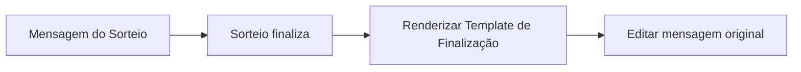

---

## 18.2. Enviar nova mensagem

Fluxo:

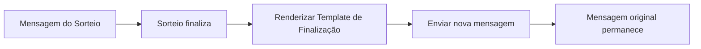

---

# 19. Fluxo completo — participação por botão

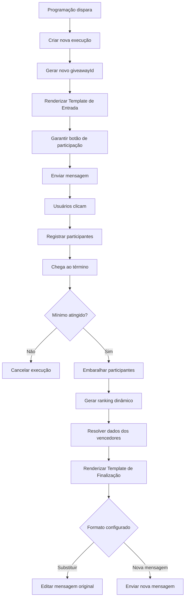

---

# 20. Fluxo completo — participação por cargos

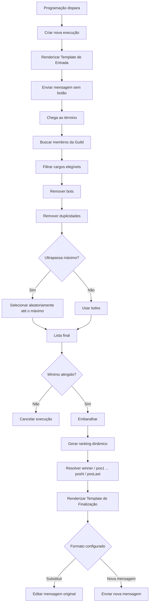

---

# 21. Relação entre configuração e execução

Para suportar recorrência corretamente, deverá existir a separação conceitual entre:

```text
Configuração do Sorteio
e
Execução do Sorteio
```

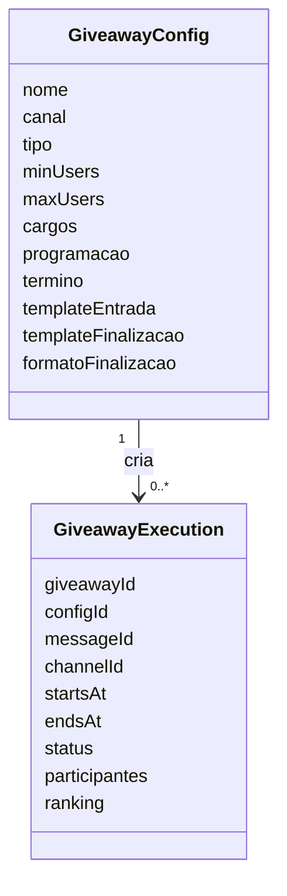

Exemplo:

```text
Configuração:
Sorteio Semanal

Execuções:
├─ giveaway-001
├─ giveaway-002
├─ giveaway-003
└─ ...
```

---

# 22. Estados de uma execução

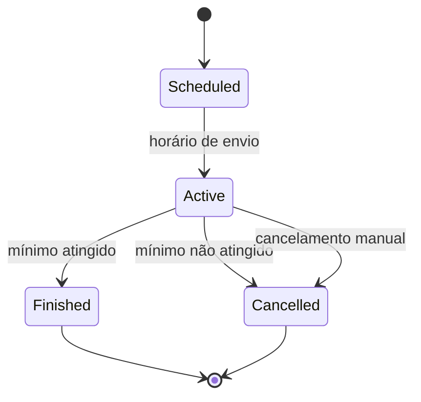

---

# 23. Resumo das decisões confirmadas

| Item | Regra |
|---|---|
| Mínimo não atingido | Cancela somente aquela execução |
| Recorrência | Cada disparo cria um sorteio novo |
| Término | Duração ou data/hora específica |
| Sobreposição | Término não pode alcançar a próxima execução |
| Tipo Botão | Participantes entram clicando |
| Tipo Cargos | Participantes resolvidos no término |
| Múltiplos cargos | Uma entrada por usuário |
| Bots | Não participam |
| Máximo por cargos | Seleção aleatória até o limite |
| Botão customizado | Passa para dentro do Template Builder |
| Falta de botão | Sistema adiciona botão padrão |
| Finalização | Editar mensagem original ou enviar nova |
| `{{winner}}` | Continua funcionando como menção |
| `{{posN}}` | Dinâmico até o último participante |
| Dados de usuário | ID, nomes, avatar, banner e funções seguras |
| Templates | Continuam utilizando Message Builder V2 |

---

# 24. Resultado esperado

O novo sistema permitirá utilizar uma única configuração para criar sorteios recorrentes completos e independentes.

Exemplo:

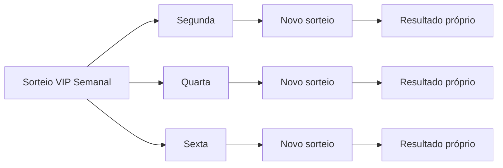

Além disso, os templates poderão produzir layouts avançados usando diretamente informações dos vencedores, por exemplo:

```text
Imagem:
{{pos1.displayAvatarURL({ size: 2048 })}}

Título:
🥇 {{pos1.displayName}}

Descrição:
Parabéns {{pos1}}!
```

Isso mantém a flexibilidade visual do Message Builder V2 e torna o sistema adequado tanto para sorteios simples quanto para eventos recorrentes mais elaborados.
